<p align="center">
  <picture>
    <source media="(prefers-color-scheme: dark)" srcset="docs/assets/logo-dark.svg">
    
  </picture>
</p>

<p align="center">
  <a href="https://github.com/jejjohnson/kernellib/actions/workflows/ci.yml"></a>
  <a href="https://github.com/jejjohnson/kernellib/actions/workflows/typecheck.yml"></a>
  <a href="https://github.com/jejjohnson/kernellib/actions/workflows/pages.yml"></a>
  <a href="https://codecov.io/gh/jejjohnson/kernellib"></a>
  
  <a href="https://opensource.org/licenses/MIT"></a>
</p>

<p align="center">
  <a href="https://jejjohnson.github.io/kernellib/"><b>Docs</b></a> ·
  <a href="https://jejjohnson.github.io/kernellib/reference/"><b>API</b></a> ·
  <a href="https://jejjohnson.github.io/kernellib/kernels-and-jax/"><b>Tutorial</b></a> ·
  <a href="#gallery"><b>Gallery</b></a>
</p>

**Kernels and scalable kernel methods for JAX.**

A kernel in kernellib is an Equinox module: it evaluates a Gram matrix, composes with other kernels, and differentiates under `jit`, `vmap` and `grad`.
The same object becomes a [gaussx](https://github.com/jejjohnson/gaussx) operator that is never formed, approximates itself with random or Nyström features, and feeds kernel ridge regression at scale, dependence measures (HSIC, CKA, MMD), graph kernels and eigenmaps.
Scale is inherited from gaussx's solvers rather than reimplemented.
Gaussian processes, priors and inference live in [pyrox-gp](https://github.com/jejjohnson/pyrox), which builds on kernellib.

<p align="center">
  <picture>
    <source media="(prefers-color-scheme: dark)" srcset="docs/assets/hero-dark.svg">
    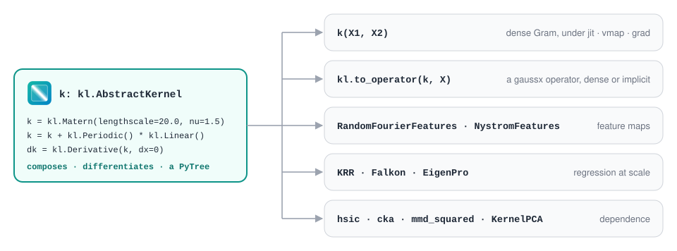
  </picture>
</p>

## Installation

kernellib is not on PyPI yet; install it from GitHub with [uv](https://docs.astral.sh/uv/):

```bash
uv add "kernellib @ git+https://github.com/jejjohnson/kernellib.git"
```

gaussx and geonnax are not on PyPI either.
kernellib pins both to release tags in its own `pyproject.toml`, so they resolve with no extra configuration.
Two extras are optional: `kernellib[sklearn]` for the scikit-learn adapters in `kernellib.sklearn`, and `kernellib[neighbors]` for approximate nearest neighbours (pynndescent) in the eigenmap graphs.
The core never imports NumPyro or scikit-learn.

## Quick start

Kernel ridge regression on a noisy sine, its gradient with respect to the lengthscale, a 40-point lengthscale sweep in one `vmap`, and an independence measure.

```python
import einx
import jax
import jax.numpy as jnp
import jax.random as jr
import kernellib as kl
from jaxtyping import Array, Float


# Shapes: N = 200 training points, T = 100 validation points, D = 1, L = 40 lengthscales
k_x, k_e, k_v = jr.split(jr.key(0), 3)
x: Float[Array, " N"] = jr.uniform(k_x, (200,), minval=-3.0, maxval=3.0)  # (N,)
# y = sin 2x + ε,  ε ~ 𝒩(0, 0.1²)
y: Float[Array, " N"] = jnp.sin(2.0 * x) + 0.1 * jr.normal(k_e, (200,))   # (N,)
X: Float[Array, "N 1"] = einx.id("n -> n 1", x)            # (N,) → (N, D)
x_val: Float[Array, " T"] = jr.uniform(k_v, (100,), minval=-3.0, maxval=3.0)
X_val: Float[Array, "T 1"] = einx.id("t -> t 1", x_val)   # (T,) → (T, D)

# k(x, x′) = σ² exp(−‖x − x′‖² / 2ℓ²)
k = kl.RBF(lengthscale=0.5)                                # an Equinox module
K: Float[Array, "N N"] = k(X, X)                           # (N, D), (N, D) → (N, N)
# The same K as a lineax operator that gaussx can solve, never formed
K_op = kl.to_operator(k, X, implicit=True)                 # (N, D) → (N, N) operator

# (K + λ N I) α = y,  f̂(x) = k(x, X) α
krr = kl.KRR(k, regularization=1e-3).fit(X, y)             # (N, D), (N,) → α (N,)
f_val: Float[Array, " T"] = krr.predict(X_val)             # (T, D) → (T,)


# The fitted model is a PyTree, so the fit differentiates and vectorises
def val_mse(ell: Float[Array, ""]) -> Float[Array, ""]:
    # MSE(ℓ) = (1/T) Σₜ (f̂_ℓ(xₜ) − sin 2xₜ)²
    fit = kl.KRR(kl.RBF(lengthscale=ell), regularization=1e-3).fit(X, y)
    return jnp.mean((fit.predict(X_val) - jnp.sin(2.0 * x_val)) ** 2)  # (T,) → ()


dmse: Float[Array, ""] = jax.grad(val_mse)(jnp.array(0.5))  # ∂MSE/∂ℓ at ℓ = 0.5
ells: Float[Array, " L"] = jnp.geomspace(0.05, 3.0, 40)   # (L,)
curve: Float[Array, " L"] = jax.vmap(val_mse)(ells)        # 40 fits in one vmap: (L,) → (L,)

# HSIC(x, y) = ‖C_xy‖²_HS: zero if and only if x ⫫ y, for characteristic kernels
dep: Float[Array, ""] = kl.hsic(k, kl.RBF(), X, einx.id("n -> n 1", y))  # → ()
```

The fit recovers sin 2x to an RMSE of 0.023 on the validation points, and the sweep puts the best lengthscale at 0.77.

## Example: map methane from one overpass

The running example of the GeoML stack, cut down to what kernellib does.
[pyrox](https://github.com/jejjohnson/pyrox#example-map-methane-from-one-overpass) uses the same overpass to tune the covariance by its evidence; here that covariance is fixed and put to work.

The state x is XCH₄ in ppb on a 100 × 100 grid over the Permian Basin, so N = 10,000 cells.
One overpass leaves M of them cloud-free (M = 6,017 here), and aᵢ = yᵢ − x_b is the anomaly of observed cell i against the background x_b = 1,880 ppb.
Cell centres are 3-D positions sᵢ in km on a sphere of radius R_E = 6,371 km, so ‖sᵢ − sⱼ‖ is a chordal distance in km.
The block below simulates the overpass (a 40 ppb plume, σ_obs = 8 ppb pixel noise, 60 % cloud-free); a real L2 product's pixels drop in for `lonlat`, `mask` and `a`.

```python
import einx
import geonnax as gnx
import jax
import jax.numpy as jnp
import jax.random as jr
import kernellib as kl
from jaxtyping import Array, Bool, Float


jax.config.update("jax_enable_x64", True)

# Shapes: N = 10,000 grid cells (100 × 100), M = Σᵢ maskᵢ cloud-free cells,
#         R = 500 Nyström landmarks, F random features, m = 500 Falkon centres
lon, lat = jnp.meshgrid(jnp.linspace(-104.2, -103.4, 100), jnp.linspace(31.6, 32.4, 100))
lonlat: Float[Array, "N 2"] = einx.id("h w, h w -> (h w) (1 + 1)", lon, lat)  # (N, 2) °
# s(λ, φ) = R_E (cos φ cos λ, cos φ sin λ, sin φ),  R_E = 6,371 km
unit = gnx.geo.lonlat_to_cartesian3d(lonlat, input_unit="degrees")  # (N, 2) → (N, 3)  geonnax
s: Float[Array, "N 3"] = 6371.0 * unit                     # (N, 3)  km, so ‖sᵢ − sⱼ‖ is in km

# Stand-in overpass:  x(λ, φ) = x_b + 40 exp(−‖(λ, φ) − (λ₀, φ₀)‖² / 2·0.08²)  ppb
x_b: float = 1880.0                                        # background XCH₄, ppb
offset = einx.subtract("n d, d -> n d", lonlat, jnp.array([-103.8, 32.0]))  # (N, 2)
d2: Float[Array, " N"] = einx.sum("n [d]", offset**2)      # (N, 2) → (N,)
x_true: Float[Array, " N"] = x_b + 40.0 * jnp.exp(-d2 / (2 * 0.08**2))  # (N,)  ppb
# yᵢ = xᵢ + εᵢ,  εᵢ ~ 𝒩(0, 8²),  kept where the pixel is cloud-free (p = 0.6)
k_mask, k_noise = jr.split(jr.key(0))
mask: Bool[Array, " N"] = jr.bernoulli(k_mask, 0.6, (10_000,))  # (N,)
eps: Float[Array, " N"] = 8.0 * jr.normal(k_noise, (10_000,))  # (N,)  ppb
s_obs: Float[Array, "M 3"] = s[mask]                       # (N, 3) → (M, 3)
# aᵢ = yᵢ − x_b, the anomaly the methods work on
a: Float[Array, " M"] = (x_true + eps - x_b)[mask]         # (N,) → (M,)  ppb
M: int = int(jnp.sum(mask))
```

### Stage 1: one covariance, three representations (geonnax → kernellib → gaussx)

**TL;DR.** Build the field's covariance once, then hand it to each method in the form that method needs: exact but never formed, or as low-rank features.

**Problem.** k_θ is the Matérn-3/2 kernel with θ = (ℓ, σ²), lengthscale ℓ in km and variance σ² in ppb².
θ̂ = (18 km, 60 ppb²) is close to what pyrox-gp's evidence fit returns on the 20 × 20 version of this overpass (ℓ ≈ 18 km, σ² ≈ 59 ppb²).
K ∈ ℝ^{M×M} is the Gram matrix on the observed centres, with entries

$$K_{ij} = k_{\hat\theta}(\lVert s_i - s_j \rVert)$$

$$k_\theta(r) = \sigma^2 \left(1 + \frac{\sqrt{3} r}{\ell}\right) \exp\left(-\frac{\sqrt{3} r}{\ell}\right)$$

Dense, K takes 290 MB in float64 at M = 6,017 and every solve costs O(M³).
Two ways round that: an operator whose matrix–vector products stream rows of K, so it is never stored, and a factorisation

$$K \approx \Phi \Phi^\top$$

with Φ ∈ ℝ^{M×R}, from R Nyström landmarks or from random Fourier features drawn from the kernel's spectral density.

```python
# k(r) = σ² (1 + √3 r / ℓ) exp(−√3 r / ℓ),  r = ‖sᵢ − sⱼ‖;  θ̂ = (ℓ, σ²) = (18 km, 60 ppb²)
k = kl.Matern(lengthscale=18.0, variance=60.0, nu=1.5)     # an Equinox module  kernellib

# K = [k(sᵢ, sⱼ)]ᵢⱼ, as an operator whose matvecs stream rows: K is never formed
K = kl.to_operator(k, s_obs, implicit=True)                # (M, 3) → (M, M) lineax operator

# K ≈ Φ Φᵀ,  Φ = K_MR K_RR^(−1/2),  R = 500 landmarks (Nyström)
nystrom = kl.NystromFeatures(n_components=500, key=jr.key(1)).fit(k, s_obs)
phi_nys: Float[Array, "M R"] = nystrom.features(s_obs)     # (M, 3) → (M, R)

# K ≈ Φ Φᵀ,  Φ = [cos ωᵀs, sin ωᵀs] / √F,  ω ~ p(ω) the Matérn spectral density, F = 1,000
rff = kl.RandomFourierFeatures(n_features=1000, key=jr.key(2)).fit(k, s_obs)
phi_rff: Float[Array, "M F2"] = rff.features(s_obs)        # (M, 3) → (M, 2F)
```

On 1,000 observed cells, the Nyström features match K to 0.15 % in Frobenius norm and the random Fourier features to 2.5 %.
The Nyström Φ takes 24 MB against 290 MB for dense K.

### Stage 2: the map, exactly and at scale (kernellib → gaussx)

**TL;DR.** Map XCH₄ on all 10,000 cells from the 6,017 clear pixels, once exactly and once with 500 centres, and check that the two agree.

**Problem.** Kernel ridge regression finds weights α ∈ ℝᴹ that minimise

$$\frac{1}{M} \lVert a - K\alpha \rVert^2 + \lambda \alpha^\top K \alpha$$

and so solve

$$(K + \lambda M I_M) \alpha = a$$

With λ = σ̂²_obs / M the system matrix is K + σ̂²_obs I_M, and the map x̂(s) = x_b + k(s, S_obs) α is exactly the Gaussian-process posterior mean.
Falkon keeps the same objective but restricts the solution to m = 500 centres, so it solves an m × m system with K_Mm ∈ ℝ^{M×m}, the kernel between observed cells and centres:

$$(K_{Mm}^\top K_{Mm} + \lambda M K_{mm}) \beta = K_{Mm}^\top a$$

```python
# λ = σ̂²_obs / M,  so that  (K + λ M I) α = a  is the GP posterior-mean system
lam: float = 8.0**2 / M                                    # σ̂_obs = 8 ppb

# (a) KRR, exact:  (K + λ M I) α = a  by Nyström-preconditioned CG, K never formed
krr = kl.KRR(k, regularization=lam, implicit=True, preconditioner="nystrom")
krr = krr.fit(s_obs, a, key=jr.key(3))                     # (M, 3), (M,) → α (M,)
# x̂(s) = x_b + k(s, S_obs) α
x_krr: Float[Array, " N"] = x_b + krr.predict(s)           # (N, 3) → (N,)  ppb

# (b) Falkon:  α restricted to m = 500 centres,  (K_mM K_Mm + λ M K_mm) β = K_mM a
falkon = kl.Falkon(k, n_inducing=500, regularization=lam).fit(s_obs, a, key=jr.key(4))
x_falkon: Float[Array, " N"] = x_b + falkon.predict(s)     # (N, 3) → (N,)  ppb
```

KRR converges in 9 preconditioned-CG iterations and Falkon in 14.
Both maps sit 0.96 ppb (KRR) and 0.95 ppb (Falkon) RMS from the true field, against 8.1 ppb for the raw pixels, and differ from each other by at most 0.8 ppb.
The plume peak comes out at 1,918.8 ppb against a true 1,919.9 ppb.

### Stage 3: is the anomaly real? (kernellib)

**TL;DR.** Before reading a plume off the map, test whether the anomaly depends on location at all, with a test whose false-alarm rate is exact.

**Problem.** Under H₀ the anomaly is independent of position, a ⫫ s.
HSIC is the squared Hilbert–Schmidt norm of the cross-covariance operator C_sa between the two kernels' feature spaces, and is zero exactly when a ⫫ s for characteristic kernels:

$$\mathrm{HSIC}(s, a) = \lVert C_{sa} \rVert_{\mathrm{HS}}^2$$

Shuffling a breaks any pairing with s, so P shuffles a_π simulate the null and give the permutation p-value

$$p = \frac{1 + \#\{\pi : \mathrm{HSIC}(s, a_\pi) \geq \mathrm{HSIC}(s, a)\}}{1 + P}$$

```python
# H₀: a ⫫ s, the anomaly carries no spatial structure  vs  H₁: it depends on location
a_col: Float[Array, "M 1"] = einx.id("m -> m 1", a)        # (M,) → (M, 1)
k_s = kl.Matern(lengthscale=18.0, nu=1.5)                  # on positions, km
k_a = kl.RBF(lengthscale=kl.estimate_lengthscale(a_col))   # on the anomaly, median heuristic


# HSIC(s, a) = ‖C_sa‖²_HS,  on F random features, so each statistic costs O(M F)
def hsic(S: Float[Array, "M 3"], A: Float[Array, "M 1"]) -> Float[Array, ""]:
    approx = kl.RandomFourierFeatures(n_features=256, key=jr.key(5))
    return kl.hsic(k_s, k_a, S, A, approx=approx)          # (M, 3), (M, 1) → ()


# p = (1 + #{HSIC(s, a_π) ≥ HSIC(s, a)}) / (1 + P),  P = 200 shuffles of a
plume = kl.permutation_test(hsic, s_obs, a_col, key=jr.key(6), n_permutations=200)
# The same test on a plume-free overpass:  aᵢ = εᵢ
eps_col: Float[Array, "M 1"] = einx.id("m -> m 1", eps[mask])  # (N,) → (M, 1)
control = kl.permutation_test(hsic, s_obs, eps_col, key=jr.key(6), n_permutations=200)
```

The plume overpass gives p = 0.005, which is 1/201, the smallest value 200 permutations can produce.
The plume-free control gives p = 0.24, so the test does not fire on noise.
With F = 256 random features each HSIC costs O(MF) instead of O(M²), so both 200-permutation tests together take under a minute.
All three stages run in float64 in about 75 s on a CPU.

## What's inside

Each family links to its API page.
Kernel-level names take kernels and data; the array-level names in `kernellib.functional` and the operator constructors take arrays.

| Family | Kernels in | Arrays in |
|---|---|---|
| [Kernels](https://jejjohnson.github.io/kernellib/reference/kernels/) | `RBF`, `Matern`, `RationalQuadratic`, `Periodic`, `Cosine`, `Linear`, `Polynomial`, `Constant`, `White`; composition with `+`, `*`, `Scaled`, `Warped`, `Stretch`, `Shift`, `Modulated`, `Periodised`, `ActiveDims`, `Residual`; `Derivative`, `DerivativeIndexed`, `FeatureKernel` | [`functional`](https://jejjohnson.github.io/kernellib/reference/functional/): `rbf_kernel`, `matern_kernel`, … |
| [Operators](https://jejjohnson.github.io/kernellib/reference/operators/) | `to_operator`, `to_cross_operator` | `KernelOperator`, `ImplicitKernelOperator`, `ImplicitCrossKernelOperator`, `batched_kernel_matvec` |
| [Feature maps](https://jejjohnson.github.io/kernellib/reference/spectral/) | `RandomFourierFeatures`, `OrthogonalRandomFeatures`, `NystromFeatures`, `FastFoodFeatures`, `LaplaceEigenfunctionFeatures`, `select_landmarks` | `rff_operator`, `nystrom_operator`, `fastfood_operator` |
| [Heuristics](https://jejjohnson.github.io/kernellib/reference/heuristics/) | `estimate_lengthscale`, `lengthscale_grid` | `gamma_to_lengthscale`, `lengthscale_to_gamma` |
| [Regression](https://jejjohnson.github.io/kernellib/reference/regression/) | `KRR`, `Falkon`, `EigenPro`; penalties `hsic_penalty`, `laplacian_penalty` | `falkon_solve`, `falkon_predict`, `eigenpro_preconditioner`, `eigenpro_step_size` |
| [Dependence](https://jejjohnson.github.io/kernellib/reference/dependence/) | `hsic`, `cka`, `mmd_squared`, `permutation_test`, `CKAAccumulator`, `taylor_statistics` | `distance_correlation_squared`, `energy_distance`, `kernel_alignment`; `functional.hsic`, `functional.cka`, `functional.mmd_squared` |
| [Graphs](https://jejjohnson.github.io/kernellib/reference/graph/) | `knn_graph`, `radius_graph`, `delaunay_graph`, `gabriel_graph`, `grid_graph`, `mesh_graph` | `graph_laplacian`, `laplacian_eigpairs`, `diffusion_kernel`, `matern_graph_kernel`, `structure_matrix` |
| [Decomposition](https://jejjohnson.github.io/kernellib/reference/decomposition/) | `KernelPCA`, `LaplacianEigenmaps`, `SchrodingerEigenmaps`, `LocalityPreservingProjections`, `KernelLocalityPreservingProjections` | `laplacian_eigenmap`, `schrodinger_eigenmap`, `spatial_spectral_potential` |
| [scikit-learn](https://jejjohnson.github.io/kernellib/reference/sklearn/) | `kernellib.sklearn`: `KernelRidge`, `FalkonRegressor`, `EigenProRegressor`, `HSIC`, `MMD`, `KernelPCA`, the feature maps and eigenmaps as estimators | needs `kernellib[sklearn]` |

## Where it sits

<p align="center">
  <picture>
    <source media="(prefers-color-scheme: dark)" srcset="docs/assets/layers-dark.svg">
    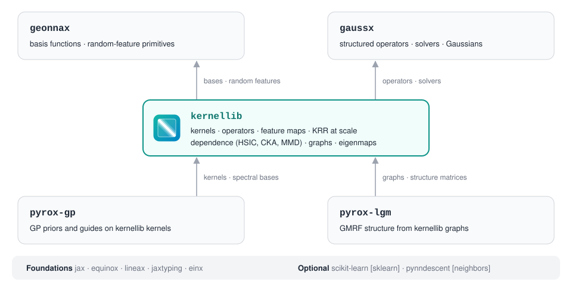
  </picture>
</p>

The rule in one sentence: anything with a kernel in it lives in kernellib, from the operators up.
gaussx is kernel-agnostic linear algebra (structured operators, solvers, preconditioners, `trace_product`), and geonnax is kernel-agnostic feature-map arithmetic.
Two rules hold the chain together: gaussx never imports kernellib, and kernellib never imports NumPyro.
The [architecture guide](https://jejjohnson.github.io/kernellib/architecture/) has the full ownership map.

## Gallery

Every figure comes from an executed notebook in the [docs](https://jejjohnson.github.io/kernellib/); each one links to its notebook.

Kernels do not need a Euclidean distance.
On a graph, the Laplacian's eigenvectors play the role of Fourier modes (left), and a graph Matérn kernel sets the smoothness of a field from them (right: one white-noise draw, three smoothness values ν, two lengthscales).

<p align="center">
  <a href="https://jejjohnson.github.io/kernellib/graphs-and-spatial/">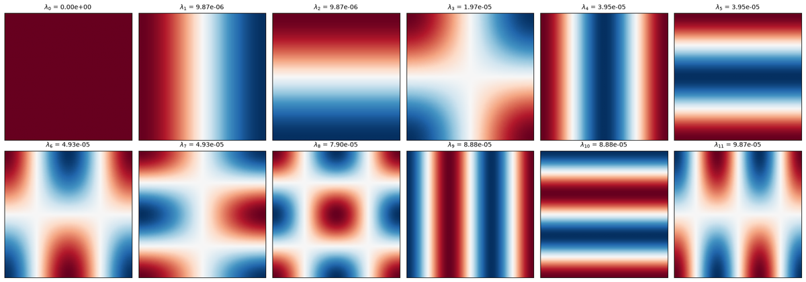</a>
  <a href="https://jejjohnson.github.io/kernellib/graphs-and-spatial/">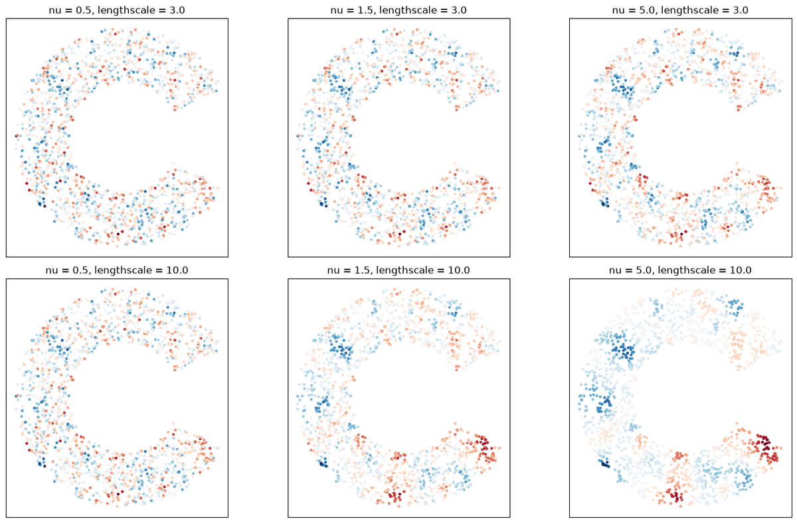</a>
</p>

Spatial-spectral eigenmaps on a synthetic hyperspectral scene with two spectrally identical regions:

<p align="center"><a href="https://jejjohnson.github.io/kernellib/spatial-spectral-eigenmaps/">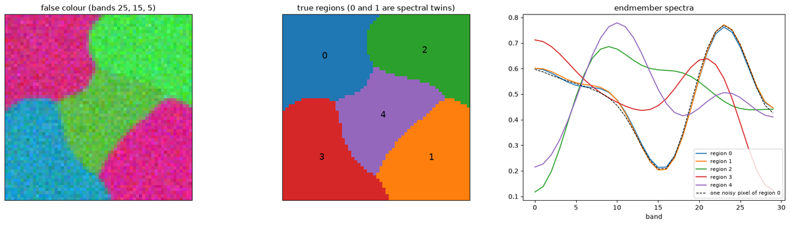</a></p>

<table>
  <tr>
    <td width="33%"><a href="https://jejjohnson.github.io/kernellib/spatial-spectral-eigenmaps/">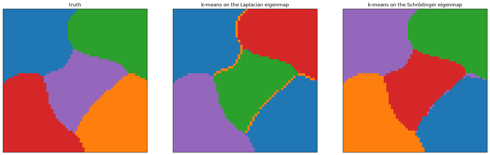</a><br><b>Schrödinger eigenmaps split spectral twins</b><br><code>decomposition</code></td>
    <td width="33%"><a href="https://jejjohnson.github.io/kernellib/graphs-and-spatial/">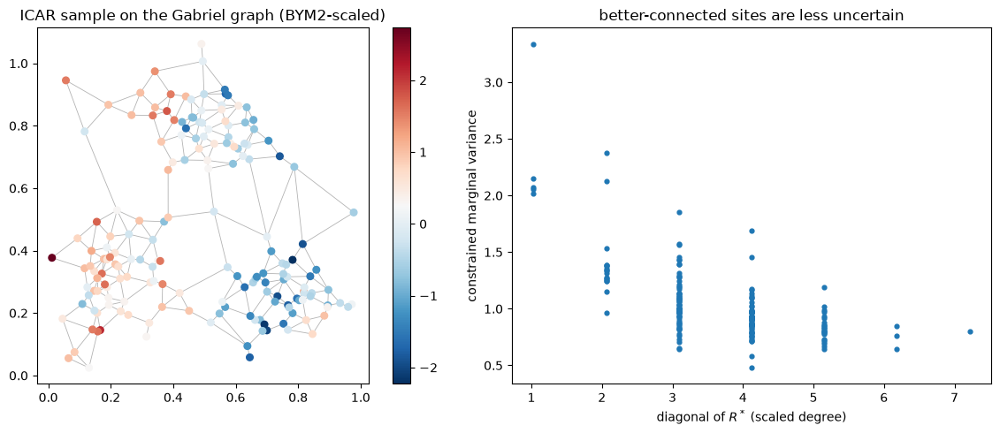</a><br><b>ICAR on a Gabriel graph</b><br><code>graphs</code></td>
    <td width="33%"><a href="https://jejjohnson.github.io/kernellib/kernels-and-jax/">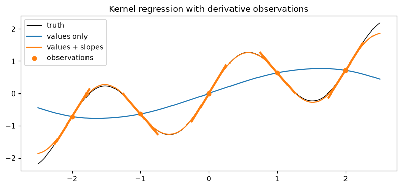</a><br><b>Regression with derivative observations</b><br><code>kernels</code></td>
  </tr>
  <tr>
    <td width="33%"><a href="https://jejjohnson.github.io/kernellib/kernels-and-jax/">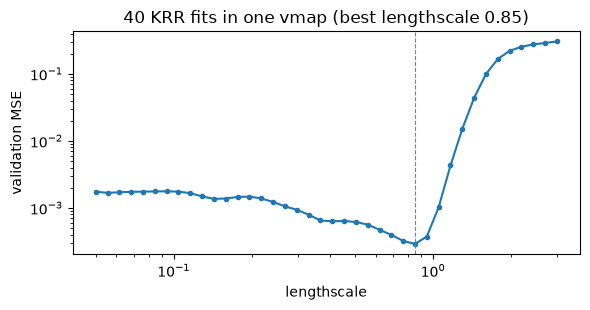</a><br><b>40 KRR fits in one vmap</b><br><code>regression</code></td>
    <td width="33%"><a href="https://jejjohnson.github.io/kernellib/regression-at-scale/">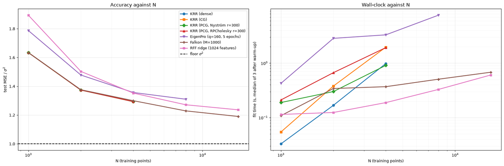</a><br><b>KRR, Falkon and EigenPro at scale</b><br><code>regression</code></td>
    <td width="33%"><a href="https://jejjohnson.github.io/kernellib/similarity-measures/">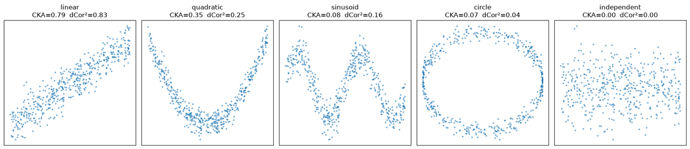</a><br><b>CKA and distance correlation on five shapes</b><br><code>dependence</code></td>
  </tr>
  <tr>
    <td width="33%"><a href="https://jejjohnson.github.io/kernellib/similarity-measures/">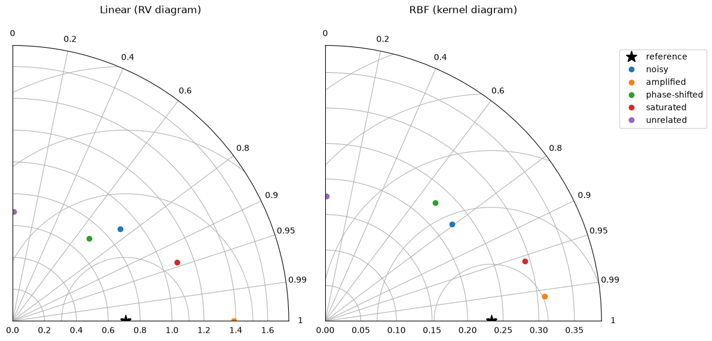</a><br><b>Kernel Taylor diagrams</b><br><code>dependence</code></td>
    <td width="33%"><a href="https://jejjohnson.github.io/kernellib/representation-similarity/">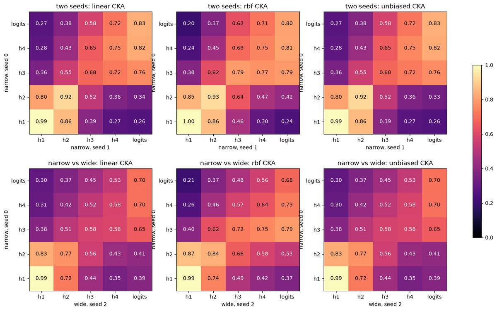</a><br><b>Comparing network layers with CKA</b><br><code>dependence</code></td>
    <td width="33%"><a href="https://jejjohnson.github.io/kernellib/sklearn-workflows/">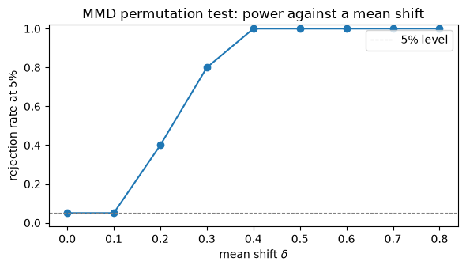</a><br><b>MMD test power</b><br><code>dependence</code></td>
  </tr>
</table>

## Related projects

| Project | Role |
|---|---|
| [gaussx](https://github.com/jejjohnson/gaussx) | Structured linear algebra, solvers, Gaussian primitives |
| [geonnax](https://github.com/jejjohnson/geonnax) | Basis functions and random-feature primitives |
| [pyrox](https://github.com/jejjohnson/pyrox) | Equinox–NumPyro bridge; GP models (`pyrox-gp`) and latent Gaussian models (`pyrox-lgm`) on kernellib |

## Development

```bash
git clone https://github.com/jejjohnson/kernellib.git
cd kernellib
make install      # all dependency groups + pre-commit hooks
make test         # fast tier: tests + doctests
make lint         # ruff check .  (entire repo)
make typecheck    # ty check src/kernellib scripts
make docs         # build both halves of the docs and verify links
```

Commit messages and PR titles follow [Conventional Commits](https://www.conventionalcommits.org/); releases are cut by Release Please.
See [CONTRIBUTING.md](CONTRIBUTING.md) for the label taxonomy and issue conventions, and [`design_docs/kernellib/architecture.md`](design_docs/kernellib/architecture.md) for the design.
The icon and diagrams are generated by [`docs/assets/render.py`](docs/assets/render.py); edit it and run `uv run --no-project python docs/assets/render.py`.

## License

MIT, see [LICENSE](LICENSE).
